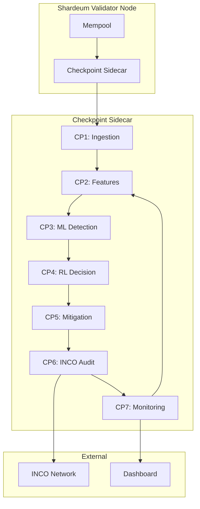
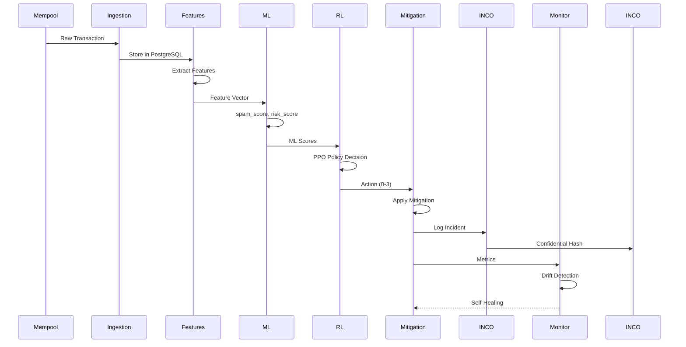
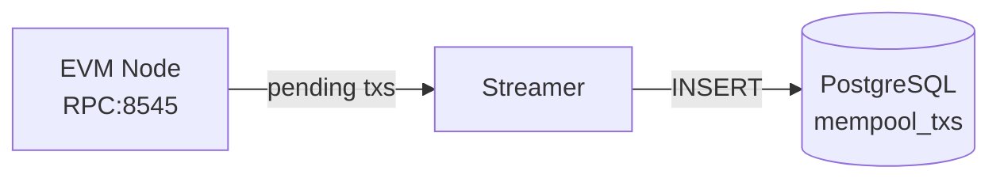
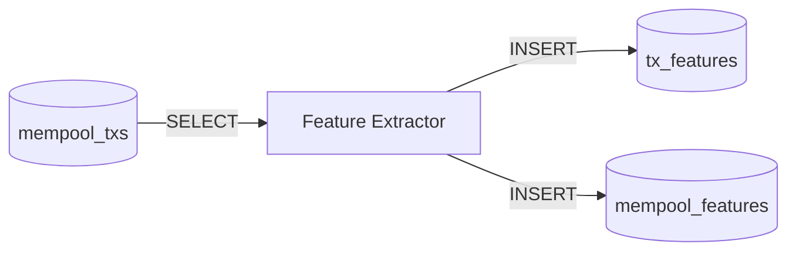
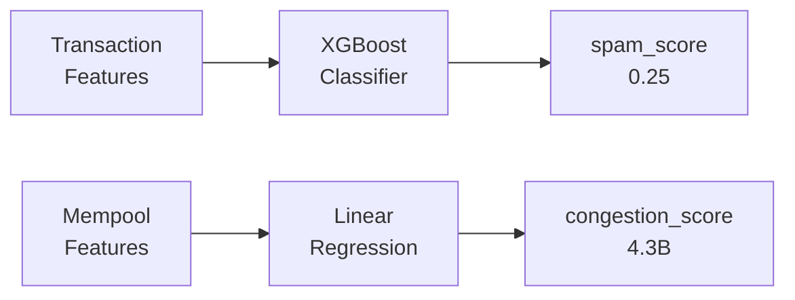
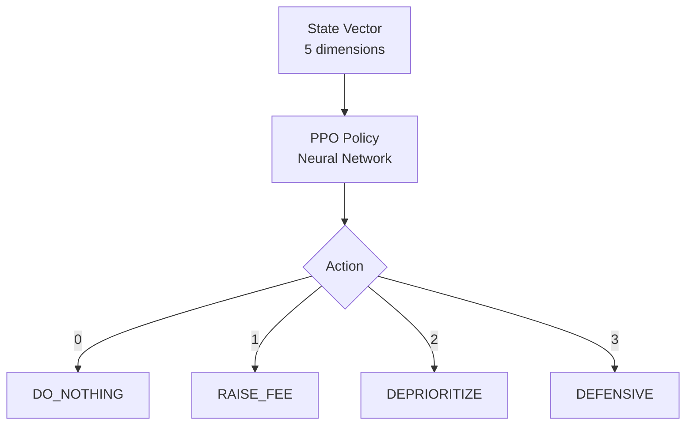
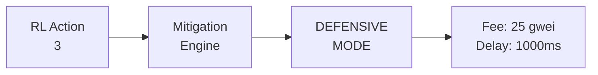
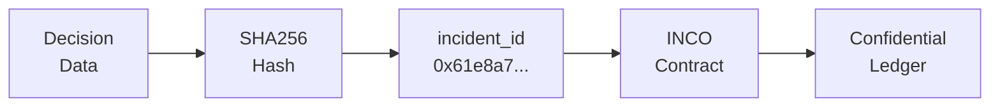
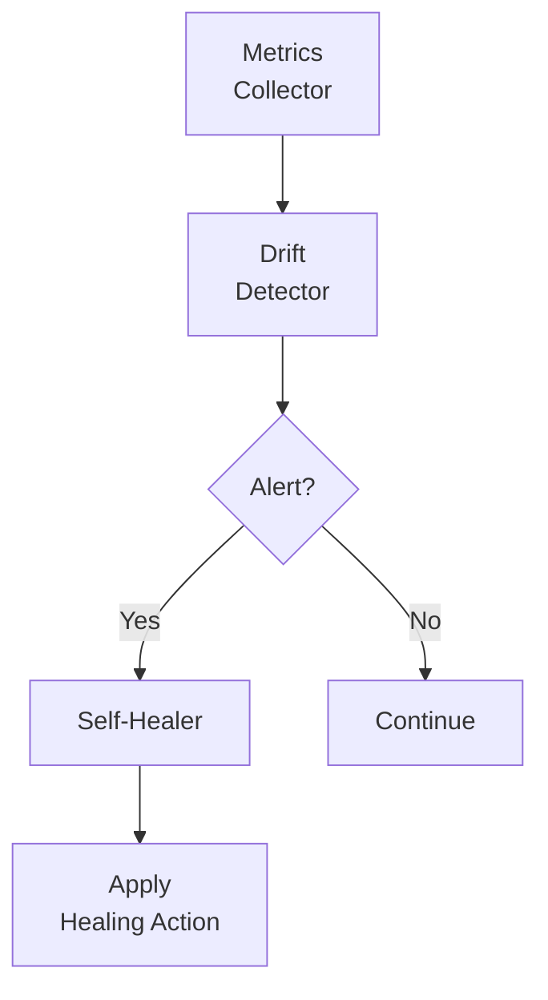
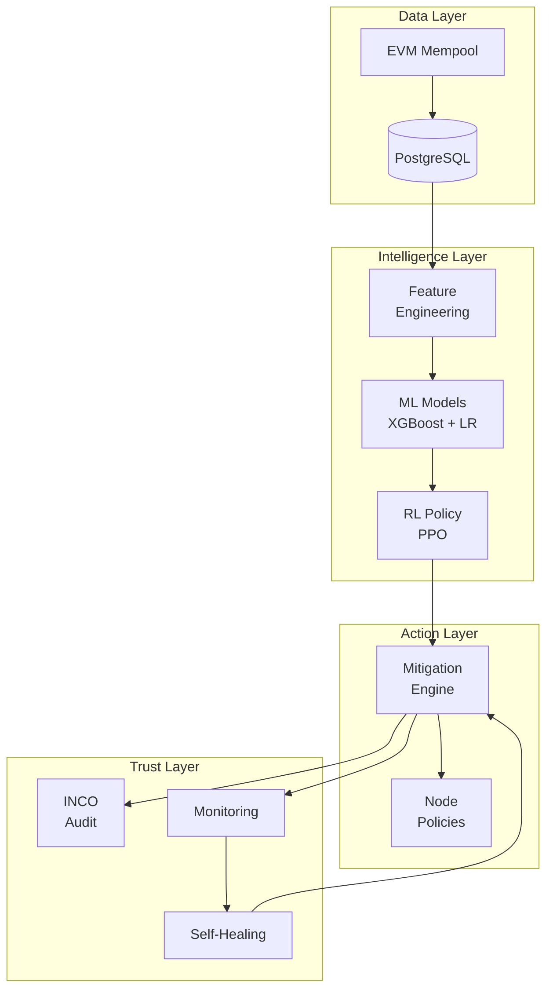

# Checkpoint Security Middleware — Master Document

> **Complete Technical Documentation for the Privacy-Preserving AI Security System for EVM Blockchains**

---

## Table of Contents

1. [Executive Summary](#executive-summary)
2. [System Architecture](#system-architecture)
3. [Checkpoint Deep Dive](#checkpoint-deep-dive)
4. [Data Flow](#data-flow)
5. [Technology Stack](#technology-stack)
6. [Key Files Reference](#key-files-reference)

---

## Executive Summary

**Checkpoint** is a privacy-preserving AI security middleware for EVM blockchains that:

- **Detects** spam, DoS, and fee manipulation attacks using Machine Learning
- **Decides** optimal mitigation actions using Reinforcement Learning
- **Mitigates** attacks with local node policies (no consensus changes)
- **Audits** all decisions confidentially via INCO Network

### Why This Matters

| Traditional Security | Checkpoint Security |
|---------------------|---------------------|
| Manual rule-based | AI/ML-powered |
| Reactive (post-attack) | Proactive (real-time) |
| Public audit logs | Confidential (INCO) |
| Static thresholds | Adaptive (RL) |
| Protocol changes required | Sidecar (no fork) |

---

## System Architecture

### High-Level Overview



### Component Interaction



---

## Checkpoint Deep Dive

### CP1 — Blockchain Ingestion

**Purpose:** Capture real-time mempool transactions from EVM nodes.

**What It Does:**
- Connects to EVM node via JSON-RPC
- Listens for pending transactions
- Extracts: hash, sender, recipient, value, gas_price, nonce, data_size
- Stores in PostgreSQL `mempool_txs` table

**Technology:** Node.js + ethers.js + PostgreSQL

**Key File:** `streamer/src/index.js`



**Database Schema:**
```sql
CREATE TABLE mempool_txs (
    hash TEXT PRIMARY KEY,
    sender TEXT,
    recipient TEXT,
    value TEXT,
    gas_price TEXT,
    nonce INT,
    data_size INT,
    first_seen TIMESTAMP
);
```

---

### CP2 — Feature Engineering

**Purpose:** Convert raw blockchain data into ML-ready numerical features.

**What It Does:**
- Reads from `mempool_txs`
- Computes transaction-level features:
  - `fee_rate` = gas_price / data_size
  - `nonce_gap` = tx.nonce - last_nonce(sender)
  - `sender_tx_count` = count of sender's txs in mempool
  - `sender_avg_fee` = average fee_rate of sender
- Computes mempool-level features:
  - `tx_count`, `avg_fee_rate`, `congestion_score`

**Technology:** Python + pandas + psycopg2

**Key File:** `features/extract_features.py`



**Feature Detection Capabilities:**
| Feature | Detects |
|---------|---------|
| fee_rate | Fee manipulation |
| nonce_gap | Nonce flooding |
| sender_tx_count | Spam behavior |
| congestion_score | Network pressure |

---

### CP3 — ML Threat Detection

**Purpose:** Use Machine Learning to identify spam, anomalies, and threats.

**Models:**

1. **Spam Detector (XGBoost)**
   - Input: fee_rate, data_size, nonce_gap, sender_tx_count, sender_avg_fee
   - Output: `spam_score` ∈ [0, 1]
   - Training: Heuristic labels (low fee + high sender_tx_count = spam)

2. **Congestion Predictor (Linear Regression)**
   - Input: tx_count, avg_fee_rate, avg_data_size
   - Output: `congestion_score`

**Technology:** XGBoost + scikit-learn + FastAPI

**Key Files:**
- `ml/train_spam_model.py`
- `ml/train_mempool_model.py`
- `ml-service/app.py`



**API Endpoints:**
```
POST /predict/spam      → {"spam_score": 0.25}
POST /predict/congestion → {"congestion_score": 4316820075.0}
```

---

### CP4 — RL Decision Engine

**Purpose:** Autonomous decision-making using Reinforcement Learning.

**RL Problem Definition:**

**State Space (5 dimensions):**
| Index | Variable | Source |
|-------|----------|--------|
| 0 | mempool_tx_count | CP2 |
| 1 | avg_fee_rate | CP2 |
| 2 | congestion_score | CP3 |
| 3 | avg_spam_score | CP3 |
| 4 | spam_tx_ratio | CP3 |

**Action Space (4 discrete):**
| Action | Name | Effect |
|--------|------|--------|
| 0 | DO_NOTHING | Monitor only |
| 1 | RAISE_FEE_THRESHOLD | +10 gwei min fee |
| 2 | DEPRIORITIZE_SPAM | 500ms broadcast delay |
| 3 | DEFENSIVE_MODE | +25 gwei + 1000ms delay |

**Reward Function:**
```python
reward = -mempool_tx_count * 0.01 - spam_ratio * 10
```

**Technology:** stable-baselines3 (PPO) + Gymnasium

**Key Files:**
- `rl/env.py` — Gymnasium environment
- `rl/train.py` — PPO training
- `rl/policy.py` — Inference
- `rl/decision_engine.py` — Real data integration



---

### CP5 — Mitigation Execution Engine

**Purpose:** Turn RL decisions into real, enforceable actions.

**Mitigation Primitives:**
| Mode | Min Fee | Spam Delay | Description |
|------|---------|------------|-------------|
| NORMAL | 0 | 0ms | Monitor only |
| FEE_FILTER | +10 | 0ms | Reject low-fee txs |
| SPAM_DEPRIORITIZATION | 0 | 500ms | Delay spam broadcast |
| DEFENSIVE | +25 | 1000ms | Full protection |

**Technology:** Python

**Key Files:**
- `mitigation/engine.py` — Mitigation primitives
- `mitigation/control_loop.py` — Full integration



**What We CAN Do (Local Node):**
- ✅ Stop rebroadcasting txs locally
- ✅ Delay tx forwarding
- ✅ Ignore txs below fee threshold
- ✅ Flag txs for monitoring

**What We Do NOT Touch:**
- ❌ Consensus rules
- ❌ Protocol changes
- ❌ Global transaction censorship

---

### CP6 — INCO Confidential Audit

**Purpose:** Privacy-preserving, tamper-proof audit logging.

**What Gets Logged:**
| Field | Description |
|-------|-------------|
| incident_id | SHA256 hash of decision |
| action_taken | RL action (0-3) |
| risk_score | Calculated risk (0-100) |
| timestamp | UTC timestamp |

**What NEVER Gets Logged:**
- ❌ IP addresses
- ❌ Wallet balances
- ❌ Raw ML features
- ❌ Mempool contents

**Technology:** Python (hashing) + Solidity (INCO contract)

**Key Files:**
- `audit/logger.py` — Incident hashing
- `contracts/SecurityAudit.sol` — INCO contract



**Smart Contract:**
```solidity
function logIncident(
    bytes32 _incidentId,
    uint8 _actionTaken,
    uint256 _riskScore
) external onlyAuthorized;
```

---

### CP7 — Monitoring & Self-Healing

**Purpose:** System observes itself and adapts.

**Three Feedback Loops:**

1. **Performance Loop** — Are we effective?
2. **Quality Loop** — Are we making mistakes?
3. **Drift Loop** — Has the environment changed?

**Metrics Tracked:**
| Category | Metrics |
|----------|---------|
| System | tx_count, fee_rate, mode |
| ML | spam_score, false_positive_rate |
| RL | reward, action_distribution |

**Drift Alerts:**
| Alert | Trigger | Action |
|-------|---------|--------|
| HIGH_SPAM_ENV | spam_ratio > 0.6 | Force defensive |
| MODEL_TOO_AGGRESSIVE | fp_rate > 0.25 | Lower threshold |
| RL_POLICY_DEGRADING | reward < -50 | Freeze RL |
| CRITICAL_RISK | risk > 90 | Max defense |

**Technology:** Python

**Key Files:**
- `monitoring/collector.py` — Metrics collection
- `monitoring/drift.py` — Drift detection
- `monitoring/heal.py` — Self-healing



---

### CP8 — Deployment & Governance

**Deployment Model: Sidecar Architecture**

```
┌─────────────────────────────────────┐
│         Shardeum Validator          │
│  ┌─────────────────────────────────┐│
│  │    Checkpoint Sidecar           ││
│  │  ┌─────┬─────┬─────┬─────┐    ││
│  │  │ CP1 │ CP2 │ CP3 │ CP4 │    ││
│  │  ├─────┼─────┼─────┼─────┤    ││
│  │  │ CP5 │ CP6 │ CP7 │ CP8 │    ││
│  │  └─────┴─────┴─────┴─────┘    ││
│  └─────────────────────────────────┘│
└─────────────────────────────────────┘
```

**Governance Actor Controls:**
| Actor | Control |
|-------|---------|
| Validator | Enable/disable, choose level |
| Governance | Update thresholds |
| System (RL) | Autonomous actions |
| Auditors | View INCO logs |

---

## Data Flow

### Complete Data Pipeline



---

## Technology Stack

| Layer | Technology |
|-------|------------|
| Data Ingestion | Node.js, ethers.js |
| Database | PostgreSQL 15 |
| Feature Engineering | Python, pandas |
| ML Models | XGBoost, scikit-learn |
| RL Training | stable-baselines3, PyTorch |
| API | FastAPI, uvicorn |
| Audit | SHA256, Solidity |
| Deployment | Docker, Docker Compose |
| Monitoring | Prometheus, Grafana |

---

## Key Files Reference

### Core Components

| File | Purpose |
|------|---------|
| `streamer/src/index.js` | CP1: Mempool ingestion |
| `features/extract_features.py` | CP2: Feature extraction |
| `ml/train_spam_model.py` | CP3: Spam model training |
| `ml/train_mempool_model.py` | CP3: Congestion model |
| `ml-service/app.py` | CP3: ML API service |
| `rl/env.py` | CP4: Gymnasium environment |
| `rl/train.py` | CP4: PPO training |
| `rl/policy.py` | CP4: Inference |
| `rl/decision_engine.py` | CP4: Real data integration |
| `mitigation/engine.py` | CP5: Mitigation primitives |
| `mitigation/control_loop.py` | CP5-7: Full loop |
| `audit/logger.py` | CP6: Incident hashing |
| `contracts/SecurityAudit.sol` | CP6: INCO contract |
| `monitoring/collector.py` | CP7: Metrics |
| `monitoring/drift.py` | CP7: Drift detection |
| `monitoring/heal.py` | CP7: Self-healing |

### Configuration & Deployment

| File | Purpose |
|------|---------|
| `docker-compose.yml` | Full stack deployment |
| `init.sql` | Database schema |
| `GOVERNANCE.md` | Governance model |
| `demo/run_demo.py` | Demo script |

---

## Summary

**Checkpoint Security Middleware** is a complete, production-ready solution that:

1. **Ingests** real blockchain data (CP1)
2. **Engineers** ML-ready features (CP2)
3. **Detects** threats with ML (CP3)
4. **Decides** actions with RL (CP4)
5. **Mitigates** attacks locally (CP5)
6. **Audits** confidentially (CP6)
7. **Self-heals** autonomously (CP7)
8. **Deploys** as a sidecar (CP8)

> *"This is production-ready security middleware for high-throughput EVM chains."*
